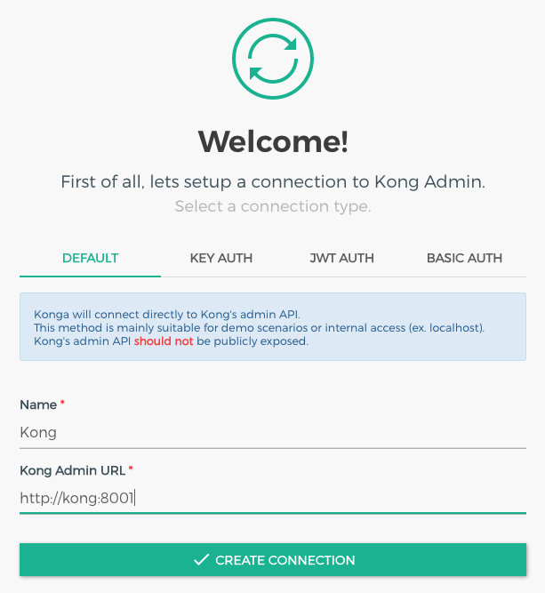
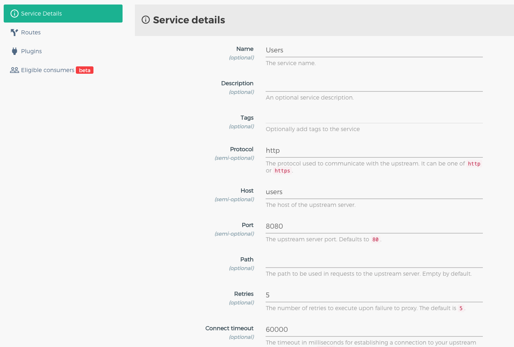
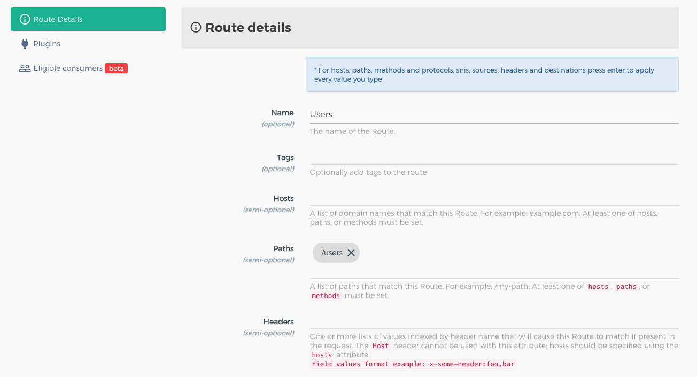
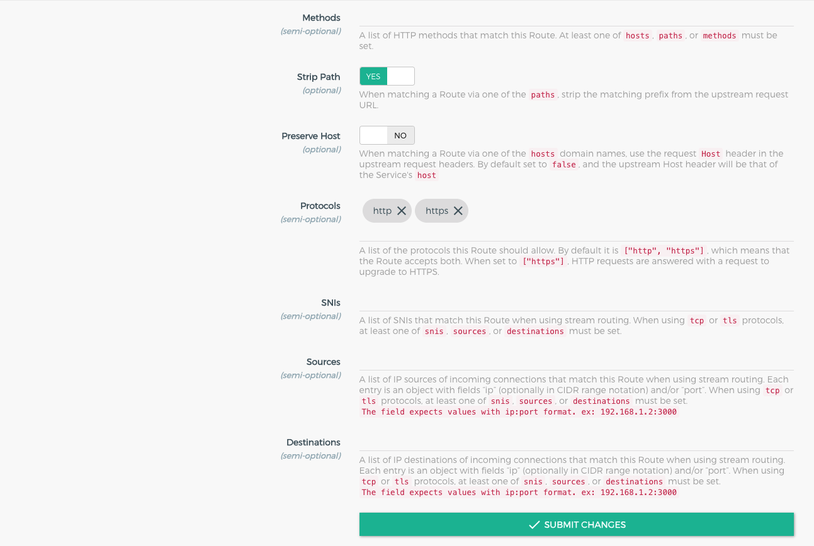

# Kong - API Gateway

## Urls

Kong:  
http://localhost:8000/

Konga:  
http://localhost:1337/

Users - Via Kong:  
http://localhost:8000/

Kong - Interno:  
http://kong:8000/

Kong Admin - Interno:  
http://kong:8000/

Users - Interno:  
http://users:8080/

## Usage

`docker-compose up -d`

## Konga Config

### Kong

### Service

### Route

  

